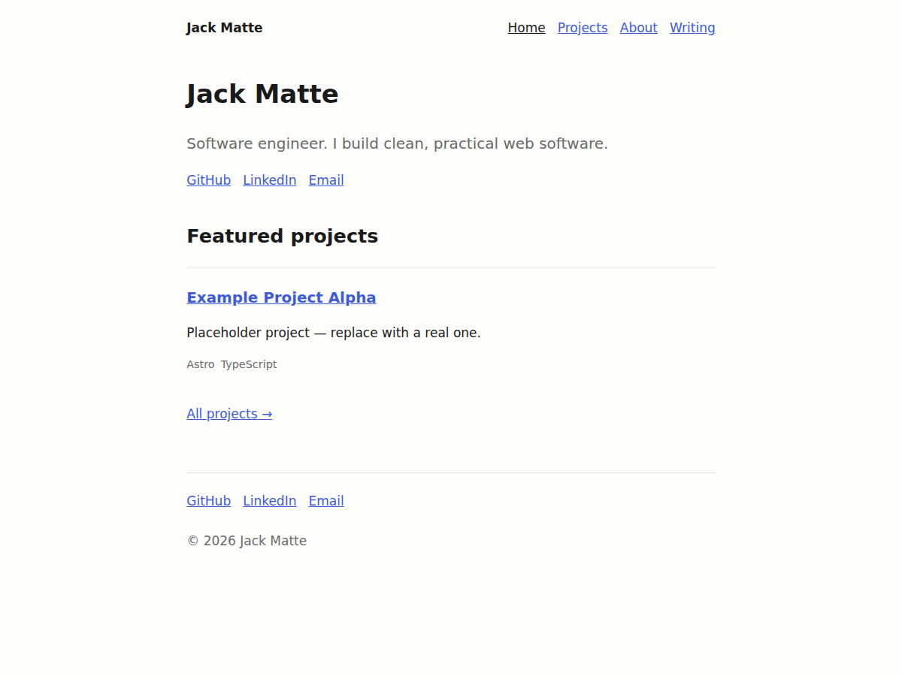

# Jack Matte — Personal Website



My personal website: a place to introduce myself, show what I've built, and
share the occasional post. It's intentionally simple and fast.

## For non-technical readers

This is a small website about me and my work. If you open the folder and want
to see it on your own computer, the "Run locally" steps below do that. You
don't need to change any code to look around — the pages are under `src/pages`
and the writeups are plain text files under `src/content`.

## Why I built this

I wanted a single, durable home on the web that I control — somewhere to point
people, showcase projects with real writeups, and grow a writing section over
time. It's also a deliberately clean build: no heavy framework, fast to load,
and easy to maintain. The code doubles as a small demonstration of how I like
to build things.

## Tech

- [Astro](https://astro.build) — static site, ships zero JavaScript by default
- TypeScript, content collections (Markdown) with typed schemas
- Plain scoped CSS with design tokens (no CSS framework)
- Vitest (unit) + Playwright (page smoke tests)

## Run locally

Prerequisites: [Node.js](https://nodejs.org) 20 or newer.

```bash
npm install          # install dependencies
npm run dev          # start the dev server at http://localhost:4321
npm run build        # build the production site into dist/
npm run preview      # preview the production build locally
```

Quality checks:

```bash
npm run check        # type + content diagnostics (astro check)
npm run test         # unit tests (Vitest)
npm run test:e2e     # page smoke tests (Playwright)
```

## Project structure

- `src/pages` — routes (home, projects, about, blog, 404)
- `src/content` — project and blog Markdown + schemas (`src/content.config.ts`)
- `src/components`, `src/layouts` — UI building blocks
- `src/lib` — small tested helpers

## Deploy

Pushing to `main` builds and deploys to GitHub Pages via
`.github/workflows/deploy.yml`. The custom domain is configured in
`public/CNAME`. In the repo's **Settings → Pages**, set the source to
**GitHub Actions**.
